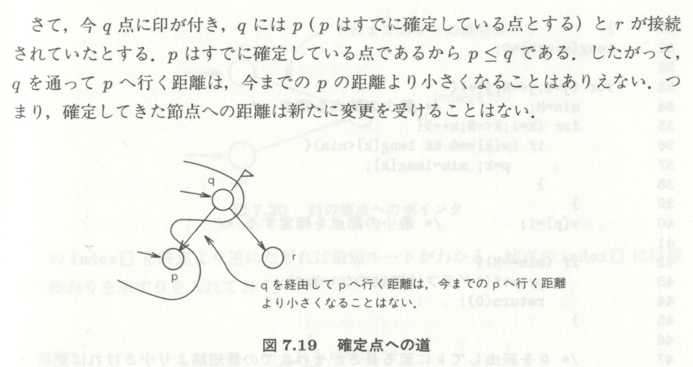
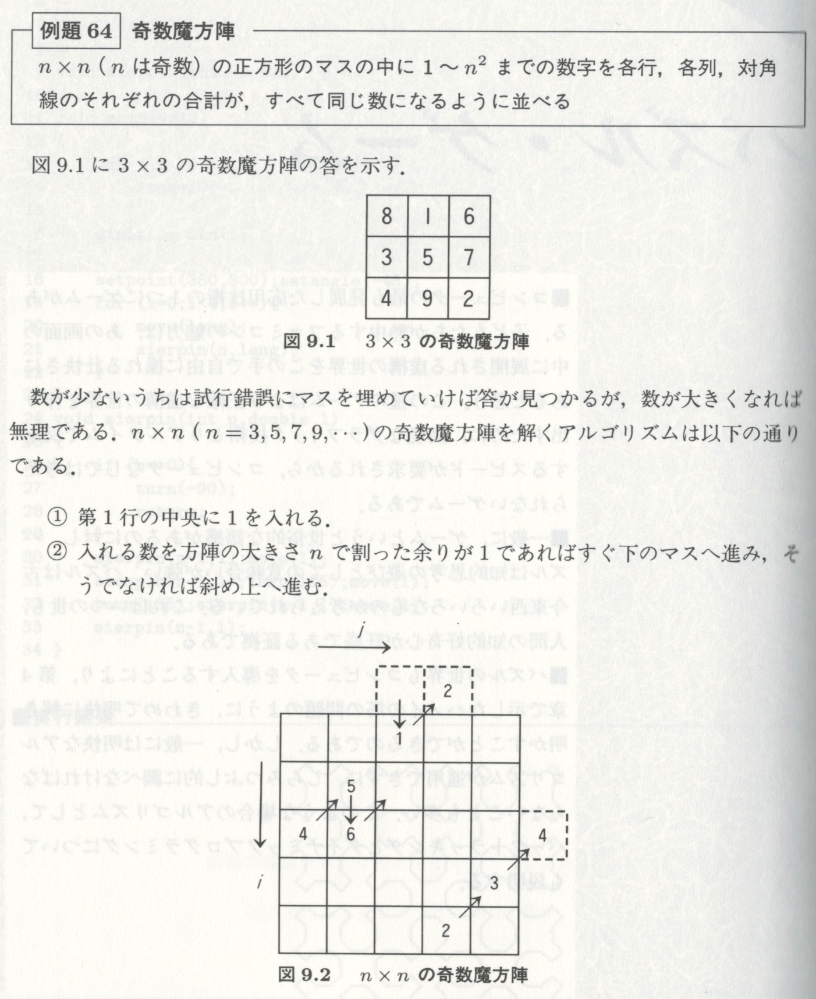

=======================================
Python入門 Part2 (実践的プログラミング)
=======================================

数値積分
========

関数が与えられた時，計算機で積分を計算するときには，こんな方法で解く．

連立方程式の解法 (ガウスジョルダン法)
=====================================

連立方程式の解を求める例を見て見ることにする．

ニュートン法
============

ニュートン法は，数値的に方程式の解を求める基本的な手法のひとつで，
機械学習でも度々登場する．

宿題
====

------------
最短経路探索
------------

各地点間の距離が与えられた時，
ある地点からある地点までの最短経路を見つける方法に
ダイクストラ法と呼ばれるアルゴリズムがある．

----------------
魔方陣の自動生成
----------------

奇数魔方陣を自動作成するプログラムを作れ．

----------
ハノイの塔
----------

この問題は，解説は長いが，コード自体はそんなに長くはならない．

.. image:: images/hanoi2.jpg
    :width: 600 px
    :align: center

.. image:: images/hanoi3.jpg
    :width: 600 px
    :align: center

